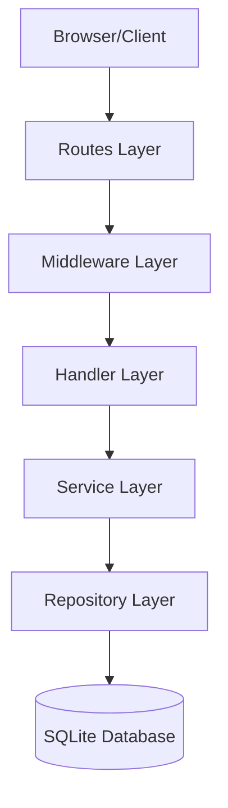
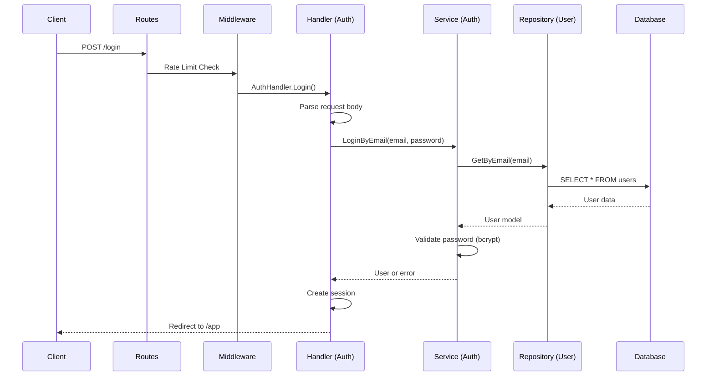
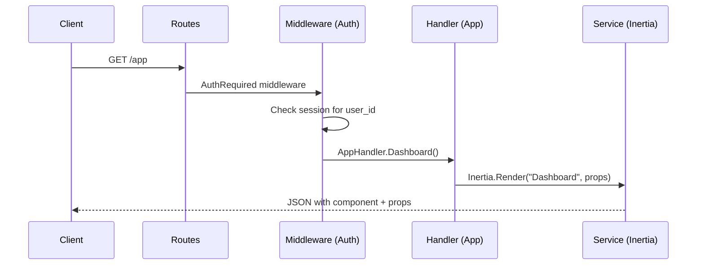
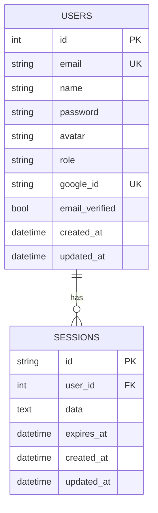
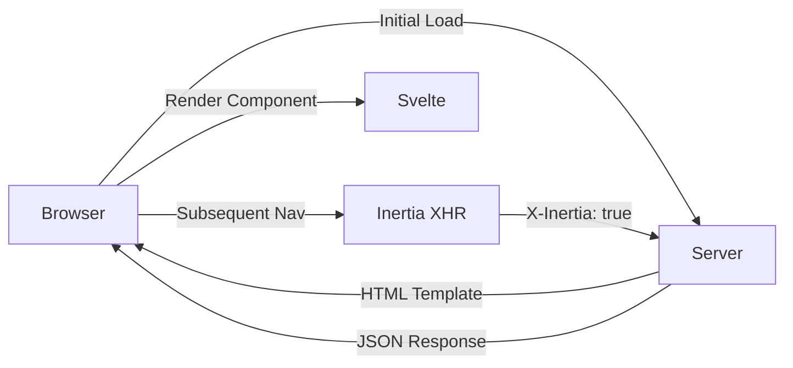

# Architecture

This document explains the architectural patterns and design decisions behind Laju Go.

## Overview

Laju Go follows a **layered architecture** (also known as n-tier architecture) that separates concerns into distinct layers. This pattern makes the codebase maintainable, testable, and scalable.

## High-Level Architecture



## Architecture Layers

### 1. Routes Layer (`routes/web.go`)

**Purpose**: Define URL endpoints and map them to handlers.

**Responsibilities**:
- Define HTTP methods and paths
- Apply middleware chains
- Set up CSRF protection
- Configure route-specific settings

**Example**:
```go
// routes/web.go
func SetupRoutes(app *fiber.App) {
    // Public routes
    app.Get("/", PublicHandler.Index)
    app.Get("/about", PublicHandler.About)
    
    // Protected routes with auth middleware
    app.Get("/app", middlewares.AuthRequired(store), AppHandler.Dashboard)
    app.Get("/app/profile", middlewares.AuthRequired(store), AppHandler.Profile)
    
    // Admin-only routes
    app.Get("/admin", middlewares.AuthRequired(store), middlewares.AdminRequired, AdminHandler.Dashboard)
}
```

### 2. Middleware Layer (`app/middlewares/`)

**Purpose**: Process requests before they reach handlers.

**Responsibilities**:
- Authentication checks
- Authorization (role-based access)
- CSRF token validation
- Rate limiting
- Logging
- Request/response modification

**Available Middleware**:

| Middleware | File | Purpose |
|------------|------|---------|
| `AuthRequired` | `auth.go` | Ensure user is authenticated |
| `AdminRequired` | `auth.go` | Ensure user has admin role |
| `Guest` | `auth.go` | Redirect authenticated users away from auth pages |
| `CSRF` | `csrf.go` | Validate CSRF tokens on state-changing requests |
| `RateLimit` | `rate-limit.go` | Throttle requests per IP/user |

**Example**:
```go
// app/middlewares/auth.go
func AuthRequired(store *session.Store) fiber.Handler {
    return func(c *fiber.Ctx) error {
        session, _ := store.Get(c)
        
        // Check if user_id exists in session
        if userID, ok := session.Get("user_id").(int); ok {
            // User is authenticated, continue to handler
            return c.Next()
        }
        
        // User not authenticated, redirect to login
        return c.Redirect("/login")
    }
}
```

### 3. Handler Layer (`app/handlers/`)

**Purpose**: Handle HTTP requests and responses.

**Responsibilities**:
- Parse request data (body, params, query)
- Validate input
- Call appropriate services
- Return responses (JSON, redirect, render)
- Handle errors

**Handler Files**:

| File | Handlers |
|------|----------|
| `auth.go` | Login, Register, OAuth, Logout |
| `app.go` | Dashboard, Profile |
| `public.go` | Index, About |
| `upload.go` | File upload |
| `password-reset.go` | Password reset request and completion |

**Example**:
```go
// app/handlers/auth.go
func (h *AuthHandler) Login(c *fiber.Ctx) error {
    // Parse request body
    var req dto.LoginRequest
    if err := c.BodyParser(&req); err != nil {
        return c.Status(fiber.StatusBadRequest).JSON(fiber.Map{
            "error": "Invalid request body",
        })
    }
    
    // Call service
    user, err := h.authService.LoginByEmail(req.Email, req.Password)
    if err != nil {
        return c.Status(fiber.StatusUnauthorized).JSON(fiber.Map{
            "error": err.Error(),
        })
    }
    
    // Store session
    session, _ := h.store.Get(c)
    session.Set("user_id", user.ID)
    session.Save()
    
    // Redirect to dashboard
    return c.Redirect("/app")
}
```

### 4. Service Layer (`app/services/`)

**Purpose**: Implement business logic.

**Responsibilities**:
- Authentication flows
- User management
- Email sending
- Password validation
- Business rules enforcement
- Transaction management

**Service Files**:

| File | Purpose |
|------|---------|
| `auth.go` | Authentication logic (email/password, OAuth) |
| `user.go` | User management (CRUD, profile updates) |
| `mailer.go` | Email sending (SMTP, templates) |
| `inertia.go` | Inertia.js rendering and responses |
| `asset.go` | Vite asset manifest resolution |

**Example**:
```go
// app/services/auth.go
func (s *AuthService) LoginByEmail(email, password string) (*models.User, error) {
    // Get user from repository
    user, err := s.userRepo.GetByEmail(email)
    if err != nil {
        return nil, ErrUserNotFound
    }
    
    // Validate password
    err = bcrypt.CompareHashAndPassword([]byte(user.Password), []byte(password))
    if err != nil {
        return nil, ErrInvalidPassword
    }
    
    // Check if user is active
    if !user.IsActive {
        return nil, ErrUserInactive
    }
    
    return user, nil
}
```

### 5. Repository Layer (`app/repositories/`)

**Purpose**: Handle database operations.

**Responsibilities**:
- CRUD operations
- Query building
- Transaction management
- Data mapping (database → domain models)

**Repository Files**:

| File | Purpose |
|------|---------|
| `user.repository.go` | User database operations |
| `session.repository.go` | Session database operations |

**Example**:
```go
// app/repositories/user.repository.go
func (r *UserRepository) GetByEmail(email string) (*models.User, error) {
    query := squirrel.
        Select("id", "email", "name", "password", "role", "avatar", "created_at", "updated_at").
        From("users").
        Where(squirrel.Eq{"email": email}).
        Limit(1)
    
    sql, args, err := query.ToSql()
    if err != nil {
        return nil, err
    }
    
    var user models.User
    err = r.db.QueryRow(sql, args...).Scan(
        &user.ID, &user.Email, &user.Name, &user.Password,
        &user.Role, &user.Avatar, &user.CreatedAt, &user.UpdatedAt,
    )
    if err != nil {
        if err == sql.ErrNoRows {
            return nil, ErrUserNotFound
        }
        return nil, err
    }
    
    return &user, nil
}
```

### 6. Models Layer (`app/models/`)

**Purpose**: Define data structures.

**Responsibilities**:
- Domain models (User, Session)
- DTOs (Data Transfer Objects)
- Validation rules

**Model Files**:

| File | Purpose |
|------|---------|
| `user.go` | User domain model |
| `session.go` | Session domain model |
| `dto.go` | Request/Response DTOs |

**Example**:
```go
// app/models/user.go
type User struct {
    ID        int       `json:"id"`
    Email     string    `json:"email"`
    Name      string    `json:"name"`
    Password  string    `json:"-"` // Hide from JSON
    Avatar    string    `json:"avatar"`
    Role      string    `json:"role"`
    GoogleID  string    `json:"-"`
    IsActive  bool      `json:"is_active"`
    CreatedAt time.Time `json:"created_at"`
    UpdatedAt time.Time `json:"updated_at"`
}

// app/models/dto.go
type LoginRequest struct {
    Email    string `json:"email"`
    Password string `json:"password"`
}

type LoginResponse struct {
    User    *User  `json:"user"`
    Token   string `json:"token"`
    Message string `json:"message"`
}
```

## Request Flow

### Authentication Flow



### Protected Route Flow



## Dependency Injection

Laju Go uses **constructor-based dependency injection** to wire layers together.

**Example**:
```go
// main.go
func main() {
    // Initialize database
    db := initDatabase()
    
    // Initialize repositories
    userRepo := repositories.NewUserRepository(db)
    sessionRepo := repositories.NewSessionRepository(db)
    
    // Initialize services
    authService := services.NewAuthService(userRepo, sessionRepo)
    userService := services.NewUserService(userRepo)
    mailerService := services.NewMailerService()
    
    // Initialize handlers
    authHandler := handlers.NewAuthHandler(authService, mailerService)
    appHandler := handlers.NewAppHandler(userService)
    
    // Setup routes
    app := fiber.New()
    routes.SetupRoutes(app, authHandler, appHandler)
    
    // Start server
    app.Listen(":8080")
}
```

## Why This Architecture?

### Benefits

1. **Separation of Concerns**
   - Each layer has a single responsibility
   - Easy to understand and maintain

2. **Testability**
   - Layers can be tested independently
   - Easy to mock dependencies

3. **Scalability**
   - Add new features without breaking existing code
   - Easy to swap implementations (e.g., SQLite → PostgreSQL)

4. **Reusability**
   - Services can be used by multiple handlers
   - Repositories can be used by multiple services

5. **Flexibility**
   - Easy to add new middleware
   - Easy to change business logic without touching handlers

### Trade-offs

1. **More Files**
   - More boilerplate than a simple MVC
   - More files to navigate

2. **Learning Curve**
   - New developers need to understand the layers
   - More abstraction than a simple script

3. **Potential Over-Engineering**
   - May be too much for very small projects
   - Consider simplifying for prototypes

## Session Infrastructure

The `app/session/` folder is intentionally separate from `app/services/`:

| Layer | Folder | Purpose |
|-------|--------|---------|
| **Infrastructure** | `session/` | Generic session management (cookie encoding, storage) |
| **Business Logic** | `services/` | Domain-specific rules (authentication, user management) |

**Why Separate?**

1. **Reusability**: `session/` can be used in any Fiber project
2. **Clear Responsibilities**: Session doesn't know about users or auth
3. **Flexibility**: Easy to swap session implementation (cookie → Redis)
4. **Testability**: Can mock session when testing services

**Dependency Relationship**:

```
services/auth.go  →  session/session.go
   (Business)         (Infrastructure)
```

## Database Design

### Schema Overview



### Design Principles

1. **Foreign Keys**: Enforce referential integrity
2. **Indexes**: Optimize common queries (email, user_id)
3. **Timestamps**: Track creation and updates
4. **Soft Deletes**: Not used (hard delete for simplicity)

## Frontend Architecture

### Inertia.js Pattern

Laju Go uses Inertia.js to bridge backend and frontend:



### Component Structure

```
frontend/src/
├── main.ts                  # Inertia initialization
├── app.css                  # Global styles
├── components/              # Reusable components
│   ├── Button.svelte
│   ├── Input.svelte
│   ├── Header.svelte
│   └── DarkModeToggle.svelte
└── pages/                   # Page components
    ├── auth/
    │   ├── Login.svelte
    │   └── Register.svelte
    └── app/
        ├── Dashboard.svelte
        └── Profile.svelte
```

## Best Practices

### 1. Keep Layers Thin

Handlers should delegate to services, not implement business logic:

```go
// ❌ Bad: Business logic in handler
func (h *Handler) Login(c *fiber.Ctx) error {
    // ... parsing ...
    
    // Don't do this in handler!
    err := bcrypt.CompareHashAndPassword([]byte(user.Password), []byte(password))
    if err != nil {
        return c.Status(401).JSON(...)
    }
    
    return c.Redirect("/app")
}

// ✅ Good: Business logic in service
func (h *Handler) Login(c *fiber.Ctx) error {
    // ... parsing ...
    
    user, err := h.authService.Login(email, password)
    if err != nil {
        return c.Status(401).JSON(...)
    }
    
    return c.Redirect("/app")
}
```

### 2. Use DTOs for Request/Response

```go
// ❌ Bad: Using domain model directly
type User struct {
    ID       int
    Password string // Should not be in response!
}

func (h *Handler) GetUser(c *fiber.Ctx) error {
    return c.JSON(user)
}

// ✅ Good: Use DTO
type UserResponse struct {
    ID    int    `json:"id"`
    Email string `json:"email"`
    Name  string `json:"name"`
}

func (h *Handler) GetUser(c *fiber.Ctx) error {
    response := UserResponse{
        ID:    user.ID,
        Email: user.Email,
        Name:  user.Name,
    }
    return c.JSON(response)
}
```

### 3. Handle Errors Gracefully

```go
// ❌ Bad: Exposing internal errors
func (h *Handler) GetUser(c *fiber.Ctx) error {
    user, err := h.userService.GetByID(id)
    if err != nil {
        return c.Status(500).JSON(fiber.Map{
            "error": err.Error(), // Don't expose internal errors!
        })
    }
    return c.JSON(user)
}

// ✅ Good: User-friendly error messages
func (h *Handler) GetUser(c *fiber.Ctx) error {
    user, err := h.userService.GetByID(id)
    if err != nil {
        if err == services.ErrUserNotFound {
            return c.Status(404).JSON(fiber.Map{
                "error": "User not found",
            })
        }
        return c.Status(500).JSON(fiber.Map{
            "error": "An unexpected error occurred",
        })
    }
    return c.JSON(user)
}
```

### 4. Validate Input Early

```go
// ✅ Good: Validate in handler before calling service
func (h *Handler) Register(c *fiber.Ctx) error {
    var req dto.RegisterRequest
    if err := c.BodyParser(&req); err != nil {
        return c.Status(400).JSON(fiber.Map{
            "error": "Invalid request body",
        })
    }
    
    // Validate email format
    if !isValidEmail(req.Email) {
        return c.Status(400).JSON(fiber.Map{
            "error": "Invalid email format",
        })
    }
    
    // Validate password length
    if len(req.Password) < 8 {
        return c.Status(400).JSON(fiber.Map{
            "error": "Password must be at least 8 characters",
        })
    }
    
    user, err := h.authService.Register(req)
    // ...
}
```

## Next Steps

- [Routing Guide](routing.md) - Route definitions and middleware
- [Database Guide](database.md) - SQLite setup and migrations
- [Authentication Guide](authentication.md) - Auth flows and session management
