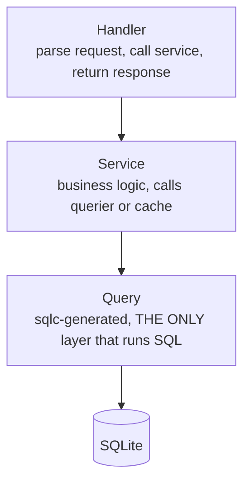

Laju Go is built to be developed alongside AI coding agents. The repo ships an `AGENTS.md` at the root that agents read automatically, plus an `.llm-wiki/` knowledge base they can query. This page is the human-readable summary of those conventions — follow them whether you are an agent or a person.

## Read AGENTS.md first

Every agent that touches this repo must start by reading `AGENTS.md`. It encodes the rules that keep generated code from rotting: the layer boundaries, the handler pattern, the Svelte 5 rules, the migration rules, and the gotchas.

The single most important line in that file:

> 🔴 **NEVER run `npm run dev:all` or any dev server.** The user handles dev servers manually.

Agents do not start dev servers. They build, they test, they generate code — they do not run long-lived processes that the user is already running.

## The three-tier rule

This is the load-bearing rule of the entire codebase. **Handler → Service → Query → DB.** No layer may skip another.



| Layer | May | May not |
|-------|-----|---------|
| **Handler** | Parse request, call a Service, return a response | Call Queries, access the DB, contain business logic |
| **Service** | Business logic, call `s.querier.*` or `s.cache.*` | `sql.Open`, `db.Exec`, raw SQL |
| **Models** | Pure data structs (entities + DTOs), used as boundary types | Business logic, DB access, import `app/queries` |
| **Cache** | In-memory session cache, called via Service | Direct access from a Handler |
| **Queries** | **The only** layer that executes SQL | — |

The one exception: test files (`*_test.go`) may call queries directly.

If you catch yourself writing `db.Exec` in a handler, or reaching for `s.querier.*` from a handler, stop. You are violating the rule. See [the three-tier rule](/architecture/three-tier/) for the full reasoning.

## The handler pattern

Every module gets its own handler file. Do not merge all routes into one giant `handler.go`.

| ✅ Correct | ❌ Wrong |
|----------|----------|
| `app/handlers/auth.go` — login, register, OAuth | `app/handlers/handler.go` — 1000+ lines, every route |
| `app/handlers/app.go` — dashboard, profile | |
| `app/handlers/upload.go` — file upload | |
| `app/handlers/public.go` — landing, public routes | |

A handler struct holds its own dependencies — do not pile everything into one struct. Here is the real pattern from `app/handlers/app.go`:

```go
type AppHandler struct {
 userService    *services.UserService
 store          *session.Store
 inertiaService *services.InertiaService
}

func NewAppHandler(userService *services.UserService, store *session.Store, inertiaService *services.InertiaService) *AppHandler {
 return &AppHandler{userService: userService, store: store, inertiaService: inertiaService}
}
```

### GET — render an Inertia page

```go
// Dashboard renders the main app dashboard using Inertia
func (h *AppHandler) Dashboard(c *fiber.Ctx) error {
 sess, _ := h.store.Get(c)
 user := sessionUser(sess)

 return h.inertiaService.Render(c, "app/Dashboard", fiber.Map{
  "user": user,
 })
}
```

### POST/PUT — parse with BodyParser, call service, respond

```go
func (h *AppHandler) UpdateProfile(c *fiber.Ctx) error {
 userID := c.Locals("user_id")
 if userID == nil {
  return c.Status(fiber.StatusUnauthorized).JSON(fiber.Map{"error": "Not authenticated"})
 }

 var req models.UpdateProfileRequest
 if err := c.BodyParser(&req); err != nil {
  return c.Status(fiber.StatusBadRequest).JSON(fiber.Map{"error": "Invalid request body"})
 }

 user, err := h.userService.UpdateProfile(userID.(int64), req)
 if err != nil {
  return c.Status(fiber.StatusInternalServerError).JSON(fiber.Map{"error": "Failed to update profile"})
 }

 return h.inertiaService.Render(c, "app/Profile", fiber.Map{
  "user":    user,
  "success": "Profile updated successfully",
 })
}
```

### Response decision table

| Scenario | Use | Example |
|----------|-----|---------|
| Show an Inertia page (GET) | `h.inertiaService.Render(c, "component", fiber.Map{...})` | Dashboard, profile, edit form |
| After POST/PUT success | `h.inertiaService.Redirect(c, "/path")` | 303 See Other, Inertia-aware |
| API endpoint for `fetch()` | `c.JSON(fiber.Map{...})` | Avatar upload response, AJAX |
| External redirect (OAuth) | `h.inertiaService.Location(c, url)` | 409 + `X-Inertia-Location` |

### Always

- Parse requests with `c.BodyParser(&req)` using a model from `app/models/` — never manual `c.Body()` or `c.Get("field")`.
- Define request DTOs in `app/models/dto.go` (or `dto_<module>.go` if bloated) with `json` tags.
- Register routes in `routes/web.go` — add the handler to the `Handlers` struct, wire it in `SetupRoutes`.

## The service layer

Services hold business logic and call `s.querier.*` or `s.cache.*` — nothing else. From `app/services/user.go`:

```go
type UserService struct {
 querier *queries.Querier
}

func NewUserService(querier *queries.Querier) *UserService {
 return &UserService{querier: querier}
}

func (s *UserService) UpdateAvatar(userID int64, avatarURL string) error {
 return s.querier.UpdateUserAvatar(context.Background(), userID, avatarURL)
}
```

Services never open database connections or write raw SQL. If you need a new query, write it in `queries/*.sql` and run `sqlc generate` — then call it through the service.

## The query layer (sqlc)

`app/queries/` is **generated**. Never edit it by hand. You write plain SQL in `queries/`:

```sql title="queries/user.sql"
-- name: GetUserByEmail :one
SELECT id, email, name, password, avatar, role, google_id, email_verified, created_at, updated_at
FROM users
WHERE email = ?;

-- name: UpdateUserAvatar :execrows
UPDATE users
SET avatar = ?, updated_at = ?
WHERE id = ?;
```

Then regenerate:

```bash
npm run db:generate   # or: make db-generate
```

sqlc produces fully typed Go functions. The `:one` annotation returns a single struct, `:execrows` returns the rows affected. See [sqlc](/database/sqlc/) for the full guide.

## Migrations

Goose migrations live in `migrations/` and run **automatically on startup**. Two rules:

1. **Never edit a deployed migration.** Goose skips already-applied migrations — editing an old file has no effect in production. Create a new file instead.
2. **One table per migration file.** See [schema & migrations](/database/schema-migrations/).

Create a new migration:

```bash
npm run db:migrate:create add_orders
```

## Frontend rules for agents

Before generating any frontend code (pages, components, landing pages):

1. **`wiki_recall` `design-principles`** — read the brief, set the three dials, apply the anti-slop rules.
2. **Pick a vibe** — minimalist, premium-consumer, playful, dark-tech, or brutalist. Refer to the vibe pages in `.llm-wiki/`.
3. **Check `frontend/src/app.css`** — use existing color tokens (`brand-*`, `secondary-*`, `neutral-*`). Do not redefine them.
4. **Apply `@theme` tokens** — all colors, shadows, and fonts live in `@theme`. Do not hardcode hex values.

### Svelte 5 specifics

- Use `$derived()` for derived state, **not** `$effect`. `$effect` is only for side effects (`document.title`, `localStorage`).
- Internal links **must** use `use:inertia` from `@inertiajs/svelte` — without it, a full page reload occurs.
- Every `fetch()` to `/app/*` or `/admin/*` **must** include the `X-XSRF-TOKEN` header from `getCSRFToken()` (`lib/utils/csrf.ts`). Inertia's `router.*` handles this automatically.
- OAuth links (`/auth/google`, `/auth/github`) use plain `<a>` without `use:inertia`.

## The LLM wiki

The repo includes an `.llm-wiki/` directory — a persistent knowledge graph of the codebase's concepts, entities, and design decisions. Agents query it with `wiki_search` or `wiki_recall` before grepping raw files.

- **concepts/** — how things work (tus upload mechanism, inertia form patterns, single-table migration)
- **entities/** — what things are (Go Fiber, Goose, sqlc, the Inertia service)
- **vibes/** — design direction references for frontend work

When you learn something non-obvious about the repo, record it with `wiki_observe` (a timestamped note) or `wiki_retro` (a durable insight). Future agents — including your future self — will find it.

## Gotchas

- **Edit `.templ` files, never `*_templ.go`.** The generated files are overwritten by `templ generate`.
- **Air does not watch `.templ` files** — regenerate manually after editing templates.
- **`go.sum` is committed.** Run `go mod tidy` after changing deps, then commit the updated `go.sum`.
- **`dist/` is gitignored** except for `.gitkeep` — it is a build artifact.
- **`.vite-port` stale?** `rm .vite-port && restart Vite`.

## Summary

| Rule | One-liner |
|------|-----------|
| Three-tier | Handler → Service → Query → DB. Never skip. |
| Handlers | One file per module. Parse with `BodyParser`, return via Inertia. |
| Services | Business logic only. Call `querier` or `cache`. No raw SQL. |
| Queries | Generated by sqlc. Never edit `app/queries/` by hand. |
| Migrations | One table per file. Never edit a deployed migration. |
| Frontend | `use:inertia` for links, `X-XSRF-TOKEN` for `fetch`, `$derived` not `$effect`. |
| Wiki | `wiki_recall` before you grep. `wiki_observe` when you learn. |
