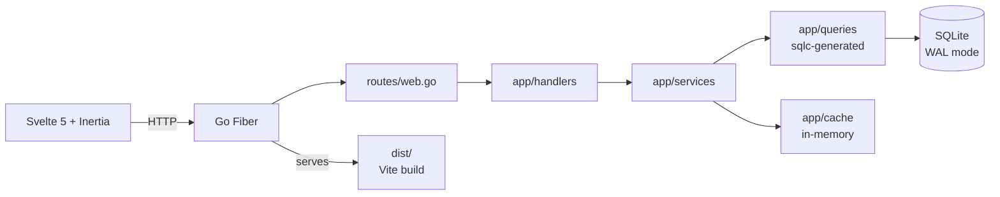

import { Card, CardGrid } from "@astrojs/starlight/components";

## What is Laju Go?

**Laju Go** is a high-performance SaaS boilerplate. "Laju" means *speed* in Indonesian and Malay — and that is the entire point: a single binary you can deploy to a $5 VPS that serves a full SPA, authenticates users, accepts uploads, and runs migrations on startup. No container orchestration required, no separate API to maintain, no ORM fighting you at 2 a.m.

The stack is deliberately small and deliberately boring:

- **Go Fiber** — fast HTTP server, single binary output
- **Svelte 5 + Inertia.js** — SPA UX without writing a separate REST API
- **SQLite** — one file, zero ops, WAL mode tuned for concurrency
- **sqlc** — type-safe Go generated from plain SQL, no ORM
- **templ** — type-safe HTML templates that compile to Go

Everything you need to ship a SaaS is wired end to end: register/login, Google OAuth, password reset, DB-backed sessions, CSRF, rate limiting, avatar uploads, TUS large-file uploads, Goose migrations, tests, and a multi-stage Dockerfile.

## What's included

<CardGrid stagger>
  <Card title="Auth, fully wired" icon="seti:lock">
    Email/password register & login, Google OAuth, password reset via SMTP, DB-backed sessions, CSRF tokens, and rate limiting — all working out of the box.
  </Card>
  <Card title="Uploads, two flavors" icon="seti:upload">
    Multipart `FormData` for avatars, and the TUS protocol (via `tusdfiber`) for resumable large-file uploads.
  </Card>
  <Card title="Type-safe data layer" icon="seti:database">
    Write SQL in `queries/*.sql`, run `sqlc generate`, get fully typed Go. No stringly-typed query builders, no runtime reflection.
  </Card>
  <Card title="SPA without an API" icon="seti:svelte">
    Inertia.js drives Svelte 5 pages from the server. `useForm` + `<form>` for CRUD — no `fetch` boilerplate, no client-side routing to maintain.
  </Card>
  <Card title="Migrations on startup" icon="seti:go">
    Goose runs automatically when the binary starts. One table per migration file, never edit a deployed migration.
  </Card>
  <Card title="Deploy anywhere" icon="seti:docker">
    Multi-stage Dockerfile, plus a `make build-linux` target that cross-compiles via Zig for CGO/SQLite.
  </Card>
</CardGrid>

## Architecture at a glance

A single Go binary is the entire backend. The frontend is built by Vite into `dist/`, which the Go binary serves using a Vite manifest.



The one rule that holds the whole thing together: **Handler → Service → Query → DB**. No layer skips another. See [the three-tier rule](/architecture/three-tier/) for why.

## Quick start

The fastest way in is the installer. It clones the template, strips dev-only files, installs Go and Node dependencies, and copies `.env.example` to `.env`:

```bash
npm create laju-go@latest my-app
cd my-app
npm run dev:all
```

`dev:all` runs Vite (frontend, port 5173) and Air (Go backend, port 8080) concurrently. Open `http://localhost:8080` — the Go server proxies Vite in development.

Prefer to run from a clone of the repo? See [Installation](/getting-started/installation/).

## Where to go next

- [Installation](/getting-started/installation/) — prerequisites, scripts, and running from source
- [Building with AI agents](/getting-started/ai-agents/) — the conventions that keep AI-generated code correct
- [Philosophy](/philosophy/) — why each piece of this stack was chosen
- [Architecture overview](/architecture/overview/) — how the layers fit together
